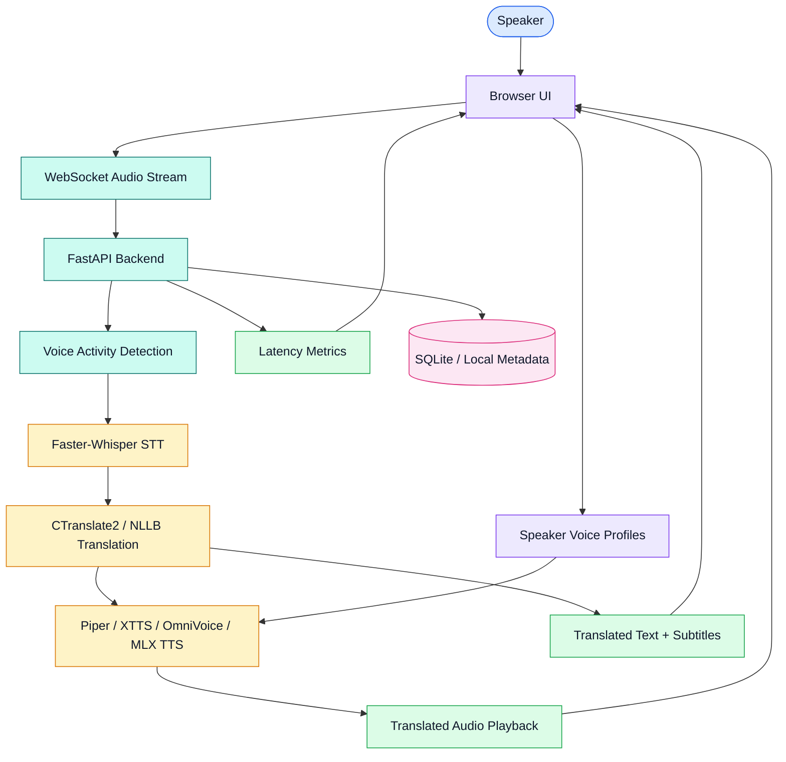

# Real-Time Speech Translation System

[](https://www.python.org/)
[](https://fastapi.tiangolo.com/)
[](https://github.com/SYSTRAN/faster-whisper)
[](https://opennmt.net/CTranslate2/)
[](https://github.com/rhasspy/piper)
[](https://developer.apple.com/metal/)

Real-time speech translation system for online conference scenarios. The project captures live speech, detects speech segments, transcribes them, translates the text, synthesizes translated audio, and displays latency metrics through a browser-based interface.

Bachelor thesis context: real-time / near-real-time speech translation during online conferences.

## Overview

This project implements a modular speech translation pipeline:

```text
Audio input -> VAD -> STT -> MT -> TTS -> translated audio + subtitles
```

The system is designed around open-source models and local execution, with special attention to Apple Silicon performance. It uses FastAPI and WebSockets for the backend streaming layer, a browser UI for interaction and visualization, and swappable model backends for transcription, translation, and speech synthesis.

## Demo

[](https://www.youtube.com/watch?v=_-jwEyGxDYs)

## Features

| Feature | Details |
| --- | --- |
| Live audio pipeline | Captures microphone audio, processes speech segments, and streams translation results. |
| Speech-to-text | Uses Faster-Whisper for transcription. |
| Machine translation | Uses CTranslate2-optimized Opus-MT models, with NLLB-200 as a fallback path. |
| Text-to-speech | Supports Piper TTS, XTTS, OmniVoice, and MLX-Audio/Qwen3-TTS experiments. |
| Voice activity detection | Uses WebRTC VAD and RMS pre-filtering to reduce unnecessary STT calls. |
| Dynamic language switching | Allows changing source and target languages from the UI. |
| Speaker voice profiles | Supports recording, uploading, renaming, deleting, and using speaker reference audio. |
| Latency visualization | Displays latency breakdown and timeline charts in the browser UI. |
| Local-first research setup | Focuses on open-source models and local hardware constraints. |

## System design



### Runtime flow

| Step | Component | Responsibility |
| --- | --- | --- |
| 1 | Browser UI | Captures microphone audio and sends chunks over WebSocket. |
| 2 | FastAPI backend | Manages sessions, model initialization, WebSocket connections, and API routes. |
| 3 | VAD layer | Filters silence and detects valid speech segments. |
| 4 | STT layer | Transcribes speech with Faster-Whisper. |
| 5 | MT layer | Translates recognized text using CTranslate2 Opus-MT or fallback translation models. |
| 6 | TTS layer | Synthesizes translated speech through the selected TTS backend. |
| 7 | UI output | Plays translated audio, displays transcription/translation, and visualizes latency. |

## Tech stack

| Layer | Choice | Notes |
| --- | --- | --- |
| Backend | FastAPI, Uvicorn, WebSockets | Streaming API and browser communication. |
| Frontend | HTML, CSS, JavaScript | Browser UI for capture, playback, language selection, and metrics. |
| STT | Faster-Whisper | Efficient Whisper inference for transcription. |
| MT | CTranslate2 Opus-MT, NLLB-200 | Local machine translation with multilingual fallback. |
| TTS | Piper TTS, XTTS, OmniVoice, MLX-Audio/Qwen3-TTS | Fast synthesis and voice cloning experiments. |
| VAD | WebRTC VAD | Speech segment detection. |
| Audio processing | soundfile, librosa, pydub, FFmpeg | Audio loading, conversion, and processing utilities. |
| Metrics | Chart.js, matplotlib, seaborn | Latency visualization and analysis. |
| Database/auth | SQLAlchemy, Alembic, python-jose, argon2 | Local metadata, user handling, and auth experiments. |
| Testing | pytest, pytest-asyncio, Playwright | Backend and UI test support. |

## Model backends

| Stage | Backend | Purpose |
| --- | --- | --- |
| STT | Faster-Whisper | Transcribes source speech into text. |
| MT | CTranslate2 Opus-MT | Fast translation for supported language pairs. |
| MT fallback | NLLB-200 | Fallback for lower-resource or unsupported language pairs. |
| TTS | Piper | Fast non-cloning speech synthesis. |
| TTS | XTTS | CPU-based zero-shot voice cloning. |
| TTS | OmniVoice | Higher-quality voice cloning; real-time mainly with NVIDIA GPU. |
| TTS | MLX-Audio/Qwen3-TTS | Apple Silicon voice cloning research path. |

## Performance focus

The project targets low-latency local execution:

| Pipeline mode | Target / observed direction |
| --- | --- |
| Standard translation | Target under ~1.5 seconds end-to-end. |
| Piper TTS | Very low synthesis latency, around ~0.1 seconds in local notes. |
| XTTS voice cloning | Slower CPU voice cloning path, around ~2–5 seconds. |
| OmniVoice | Stronger with NVIDIA GPU; CPU/MPS can be too slow for real time. |
| MLX-Audio/Qwen3-TTS | Apple Silicon optimization path for real-time voice cloning. |

## Quick start

### Prerequisites

- Python 3.9+
- Git
- FFmpeg
- BlackHole 2ch or a similar virtual audio device on macOS for audio routing tests

On macOS:

```bash
brew install ffmpeg blackhole-2ch
```

### Windows setup

Run the provided PowerShell setup script:

```powershell
.\setup_windows.ps1
```

The script installs Python, FFmpeg, Node.js, creates a virtual environment, and installs dependencies.

### macOS / Linux setup

Clone the repository:

```bash
git clone https://github.com/brusnyak/bp.git
cd bp
```

Create and activate a virtual environment:

```bash
python3 -m venv venv
source venv/bin/activate
```

Install dependencies:

```bash
pip install -r requirements.txt
```

Generate local HTTPS certificates:

```bash
openssl req -x509 -newkey rsa:4096 -nodes \
  -out certs/cert.pem \
  -keyout certs/key.pem \
  -days 365 \
  -subj "/CN=localhost"
```

Run the application:

```bash
python app.py
```

Open:

```text
https://localhost:8000
```

Your browser may ask you to accept the self-signed certificate.

## Model setup

### Piper TTS

Piper models can be downloaded manually:

```bash
python backend/tts/download_piper_models.py en_US-ryan-medium
python backend/tts/download_piper_models.py sk_SK-lili-medium
python backend/tts/download_piper_models.py cs_CZ-jirka-medium
```

### CTranslate2 translation models

Convert Opus-MT models to CTranslate2 format:

```bash
python backend/mt/convert_opus_mt_to_ct2.py --model_name Helsinki-NLP/opus-mt-en-sk
python backend/mt/convert_opus_mt_to_ct2.py --model_name Helsinki-NLP/opus-mt-sk-en
python backend/mt/convert_opus_mt_to_ct2.py --model_name Helsinki-NLP/opus-mt-en-cs
```

### Faster-Whisper

The Faster-Whisper model is downloaded automatically on first use.

### Voice cloning models

XTTS, OmniVoice, and MLX-Audio models are downloaded automatically when selected, depending on backend support and local hardware.

## Usage

1. Open `https://localhost:8000`.
2. Initialize the pipeline.
3. Select source and target languages.
4. Choose the TTS backend.
5. Optionally upload or record a speaker voice sample for voice cloning.
6. Speak into the microphone.
7. Monitor transcription, translation, playback, and latency charts.

## Testing

Run the streaming pipeline tests:

```bash
python test/streaming_pipeline_tests.py
```

For full evaluation, add test audio files to the `test/` directory:

| File | Purpose |
| --- | --- |
| `test/My test speech_xtts_speaker_clean.wav` | English speech test input. |
| `test/slovak_test_speech.wav` | Slovak speech test input. |
| `test/Voice-Training.wav` | Speaker reference audio for voice cloning. |

Matching transcript and translation reference files should be added for metric-based evaluation.

## Project structure

```text
bp/
├── app.py               # FastAPI app, WebSocket server, UI mounting
├── backend/
│   ├── main.py          # Model orchestration, routes, sessions, pipeline config
│   ├── stt/             # Faster-Whisper wrapper
│   ├── mt/              # Translation backends and model conversion scripts
│   ├── tts/             # Piper, XTTS, OmniVoice, and hybrid TTS modules
│   └── utils/           # Audio, auth, and database utilities
├── ui/                  # Browser interface
├── test/                # Streaming and pipeline tests
├── speaker_voices/      # Local speaker reference audio and metadata
├── documentation/       # Thesis notes and supporting research
├── requirements.txt
└── package.json
```

## Current development status

| Area | Status |
| --- | --- |
| Piper TTS | Integrated as the fast non-cloning synthesis backend. |
| XTTS | Integrated for CPU-based voice cloning. |
| OmniVoice | Integrated but best suited to NVIDIA GPU for real-time use. |
| MLX-Audio/Qwen3-TTS | Identified as the Apple Silicon optimization path. |
| Hybrid MT | CTranslate2 Opus-MT with NLLB fallback added. |
| UI and backend fixes | Audio processing, voice selection, and speaker profile handling improved. |
| Thesis alignment | Conference use case and latency benchmarking remain the key academic framing. |

## Roadmap

- Replace or supplement OmniVoice with MLX-Audio for Mac builds.
- Benchmark Qwen3-TTS on M1 Pro hardware for real-time voice cloning.
- Improve multi-speaker handling for conference scenarios.
- Expand evaluation with consistent Slovak/English test audio.
- Package the system for simpler installation.
- Refine thesis documentation around methodology, measurements, and limitations.

## README style direction

This repository follows the shared portfolio README structure:

- Short project description at the top.
- Technology labels for fast scanning.
- Coloured system design diagram when architecture is useful.
- Structured features, model backends, testing, and roadmap tables.
- Practical setup instructions separated from research/development notes.
