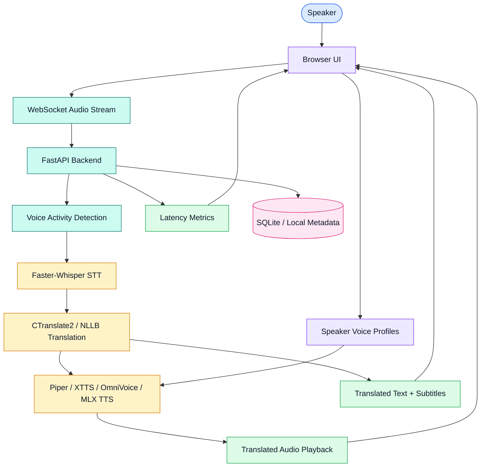

# Real-Time Speech Translation System

[](https://www.python.org/)
[](https://fastapi.tiangolo.com/)
[](https://github.com/SYSTRAN/faster-whisper)
[](https://opennmt.net/CTranslate2/)
[](https://github.com/rhasspy/piper)
[](#quick-start)

Real-time speech translation system for online conference scenarios. The project captures live speech, detects speech segments, transcribes them, translates the text, synthesizes translated audio, and displays latency metrics through a browser-based interface.

Bachelor thesis context: real-time / near-real-time speech translation during online conferences.

## Overview

This project implements a modular speech translation pipeline:

```text
Audio input -> VAD -> STT -> MT -> TTS -> translated audio + subtitles
```

The system is designed around open-source models and local execution. It is CPU-first: the default install needs no GPU and no PyTorch (about 0.7 GB of Python packages); NVIDIA, Apple Silicon (MLX) and voice-cloning engines are optional experiments. It uses FastAPI and WebSockets for the backend streaming layer, a browser UI for interaction and visualization, and swappable model backends for transcription, translation, and speech synthesis.

## Demo

[](https://www.youtube.com/watch?v=_-jwEyGxDYs)

## Features

| Feature | Details |
| --- | --- |
| Live audio pipeline | Captures microphone audio, processes speech segments, and streams translation results. |
| Speech-to-text | Uses Faster-Whisper for transcription. |
| Machine translation | Uses CTranslate2-optimized Opus-MT models, with NLLB-200 as a fallback path. |
| Text-to-speech | Piper TTS by default; XTTS, OmniVoice and MLX-Audio/Qwen3-TTS voice-cloning experiments are optional (they need PyTorch and are not part of the default install). |
| Voice activity detection | Uses WebRTC VAD and RMS pre-filtering to reduce unnecessary STT calls. |
| Dynamic language switching | Allows changing source and target languages from the UI. |
| Speaker voice profiles | Supports recording, uploading, renaming, deleting, and using speaker reference audio. |
| Latency visualization | Displays latency breakdown and timeline charts in the browser UI. |
| Local-first research setup | Focuses on open-source models and local hardware constraints. |

## System design


```mermaid
flowchart TB
    Speaker([Speaker]) --> Browser[Browser UI]
    Browser --> WebSocket[WebSocket Audio Stream]

    WebSocket --> Backend[FastAPI Backend]
    Backend --> VAD[Voice Activity Detection]
    VAD --> STT[Faster-Whisper STT]
    STT --> MT[CTranslate2 / NLLB Translation]
    MT --> TTS[Piper / XTTS / OmniVoice / MLX TTS]

    TTS --> Playback[Translated Audio Playback]
    MT --> Subtitles[Translated Text + Subtitles]
    Backend --> Metrics[Latency Metrics]
    Browser --> Voices[Speaker Voice Profiles]
    Voices --> TTS

    Backend --> DB[(SQLite / Local Metadata)]
    Metrics --> Browser
    Playback --> Browser
    Subtitles --> Browser

    classDef actor fill:#DBEAFE,stroke:#2563EB,color:#0F172A,stroke-width:1px
    classDef client fill:#EDE9FE,stroke:#7C3AED,color:#0F172A,stroke-width:1px
    classDef transport fill:#CCFBF1,stroke:#0F766E,color:#0F172A,stroke-width:1px
    classDef model fill:#FEF3C7,stroke:#D97706,color:#0F172A,stroke-width:1px
    classDef output fill:#DCFCE7,stroke:#16A34A,color:#0F172A,stroke-width:1px
    classDef data fill:#FCE7F3,stroke:#DB2777,color:#0F172A,stroke-width:1px

    class Speaker actor
    class Browser,Voices client
    class WebSocket,Backend,VAD transport
    class STT,MT,TTS model
    class Playback,Subtitles,Metrics output
    class DB data
```

### Runtime flow

| Step | Component | Responsibility |
| --- | --- | --- |
| 1 | Browser UI | Captures microphone audio and sends chunks over WebSocket. |
| 2 | FastAPI backend | Manages sessions, model initialization, WebSocket connections, and API routes. |
| 3 | VAD layer | Filters silence and detects valid speech segments. |
| 4 | STT layer | Transcribes speech with Faster-Whisper. |
| 5 | MT layer | Translates recognized text using CTranslate2 Opus-MT or fallback translation models. |
| 6 | TTS layer | Synthesizes translated speech through the selected TTS backend. |
| 7 | UI output | Plays translated audio, displays transcription/translation, and visualizes latency. |

## Tech stack

| Layer | Choice | Notes |
| --- | --- | --- |
| Backend | FastAPI, Uvicorn, WebSockets | Streaming API and browser communication. |
| Frontend | HTML, CSS, JavaScript | Browser UI for capture, playback, language selection, and metrics. |
| STT | Faster-Whisper | Efficient Whisper inference for transcription. |
| MT | CTranslate2 Opus-MT, NLLB-200 | Local machine translation with multilingual fallback. |
| TTS | Piper TTS, XTTS, OmniVoice, MLX-Audio/Qwen3-TTS | Fast synthesis and voice cloning experiments. |
| VAD | WebRTC VAD | Speech segment detection. |
| Audio processing | soundfile, librosa, pydub, FFmpeg | Audio loading, conversion, and processing utilities. |
| Metrics | Chart.js | Latency visualization in the browser. |
| Database/auth | SQLAlchemy (SQLite), argon2, PyJWT | Local metadata, user handling, session tokens. |
| Testing | pytest, pytest-asyncio, httpx | Backend, VAD, MT and security regression tests. |

## Model backends

| Stage | Backend | Purpose |
| --- | --- | --- |
| STT | Faster-Whisper | Transcribes source speech into text. |
| MT | CTranslate2 Opus-MT | Fast translation for supported language pairs. |
| MT fallback | NLLB-200 | Optional (needs PyTorch): fallback for lower-resource or unsupported language pairs. |
| TTS | Piper | Fast non-cloning speech synthesis. |
| TTS | XTTS | Optional: CPU-based zero-shot voice cloning (Linux/macOS + PyTorch; no Windows wheels). |
| TTS | OmniVoice | Optional: higher-quality voice cloning; real-time mainly with NVIDIA GPU. |
| TTS | MLX-Audio/Qwen3-TTS | Apple Silicon voice cloning research path. |

## Performance

Measured on a Ryzen 5 8645HS laptop (6 cores, 14 GB RAM, no GPU, Windows 11, Python 3.11), CPU only, int8. Details and methodology: [`documentation/model_evaluation_2026-09.md`](documentation/model_evaluation_2026-09.md).

| Stage | Result |
| --- | --- |
| STT, English, `base` | 0.7-0.8 s per short phrase |
| STT, Slovak (18 sentences, one speaker), WER at time per 7 s clip | Slovak-tuned `small` **0.26 at 2.4 s** (default) · `large-v3-turbo` 0.44 at 7.3 s · `medium` 0.46 at 7.2 s · plain `small` 0.62 at 2.2 s · Parakeet v3 0.58 at 0.9 s |
| STT, Slovak, public FLEURS test clips (60 utterances) | Slovak-tuned `small` 0.13 · `large-v3-turbo` 0.12 · Parakeet v3 (int8) 0.20 · plain `small` 0.38 (matches published numbers) |
| MT (Opus-MT, CTranslate2 int8) | about 0.05-0.1 s per sentence |
| TTS (Piper, warm) | 0.2-0.3 s per sentence (first call about 2.6 s) |
| EN -> SK end to end | roughly 1-1.5 s per sentence |

Slovak speech recognition is the hard part. Off-the-shelf Whisper is either fast and poor (`small`) or accurate and slow (`large-v3-turbo`, about real time on this CPU). The default is therefore a Slovak-fine-tuned Whisper `small` ([NaiveNeuron/whisper-small-sk](https://huggingface.co/NaiveNeuron/whisper-small-sk), MIT, trained on 2,806 h of Slovak speech, see [arXiv 2509.19270](https://arxiv.org/abs/2509.19270)), converted to CTranslate2 int8 by `scripts/setup.py`: it is as fast as `small` and close to `large-v3-turbo` in accuracy. Override with `BP_SK_STT_MODEL` (a model name or a CTranslate2 directory). Voice cloning engines (XTTS, OmniVoice, MLX) are slower and hardware-dependent; see the roadmap.

## Quick start

Works the same on Windows, macOS and Linux (CPU only, no admin rights, nothing installed globally).

**You need:** Python 3.10-3.12, Git, and FFmpeg (only for voice upload/recording; `brew install ffmpeg` / `apt install ffmpeg` / `winget install Gyan.FFmpeg`). Node.js is optional (UI chart assets).

```bash
git clone https://github.com/brusnyak/bp.git
cd bp
python scripts/setup.py        # add --dev for the test dependencies
```

`scripts/setup.py` is idempotent and does everything: virtual environment (`.venv`), dependencies (uses `uv` if installed, `pip` otherwise), a random `JWT_SECRET` in `.env`, a self-signed localhost certificate, the three Piper voices, and the one-time CTranslate2 conversion of the Opus-MT translation models and the Slovak-tuned Whisper (done in a throwaway venv, so the running app never needs PyTorch; about 1.5 GB of downloads). Use `--skip-models` to skip the conversion.

Start it:

```bash
.venv/bin/python app.py          # Windows: .venv\Scripts\python.exe app.py
```

Open `https://localhost:8000` (accept the self-signed certificate).

The server listens on `127.0.0.1` only. For a conference/LAN demo opt in explicitly with `BP_HOST=0.0.0.0` (anyone on the network can then register and use the WebSocket, so only do this on a trusted network).

### Configuration

| Variable | Default | Purpose |
| --- | --- | --- |
| `BP_HOST` / `BP_PORT` | `127.0.0.1` / `8000` | Bind address and port. |
| `JWT_SECRET` | random per process | Signs session tokens. `scripts/setup.py` writes one to `.env`. |
| `BP_SK_STT_MODEL` | local Slovak-tuned `small` (`ct2_models/whisper-small-sk`), else `large-v3-turbo` | Whisper model used when the source language is Slovak: a model name or a CTranslate2 directory. |
| `GOOGLE_CLIENT_ID` | unset | Enables Google login. |
| `BP_DEMO_USER` | unset | Set to `1` to create a `test@example.com` demo account (development only). |
| `HF_HOME` | `~/.cache/huggingface` | Where Whisper models are cached. |

All variables can live in `.env` (see [`.env.example`](.env.example)).

## Model setup

`scripts/setup.py` handles all of this; the manual equivalents are:

```bash
python backend/tts/download_piper_models.py en_US-ryan-medium     # Piper voices
python backend/tts/download_piper_models.py sk_SK-lili-medium
python backend/tts/download_piper_models.py cs_CZ-jirka-medium
python scripts/convert_models.py                                  # Opus-MT -> CTranslate2 int8, tokenizers saved alongside
```

Faster-Whisper models download on first use (`hf_xet` makes this fast). Personal/fine-tuned Piper voices are local-only: drop `<name>.onnx` + `<name>.onnx.json` into `backend/tts/piper_models/` and the `piper_personal*` engines pick them up; without them the public voices above are used. XTTS, OmniVoice and OpenVoice need PyTorch and are not part of the default install (the `xtts`, `hybrid` and `omnivoice` engines are simply not advertised).

## Usage

1. Open `https://localhost:8000`.
2. Initialize the pipeline.
3. Select source and target languages.
4. Choose the TTS backend.
5. Optionally upload or record a speaker voice sample for voice cloning.
6. Speak into the microphone.
7. Monitor transcription, translation, playback, and latency charts.

## Testing

```bash
python scripts/setup.py --dev
.venv/bin/python -m pytest test/hardware_test.py test/vad_tests.py test/mt_model_tests.py test/backend_api_tests.py test/backend_auth_tests.py test/security_tests.py test/config_tests.py -q
```

`documentation/ci.yml.example` is a ready GitHub Actions workflow that runs setup + these tests from a clean checkout on Ubuntu, macOS and Windows; copy it to `.github/workflows/ci.yml` (pushing workflow files needs a token with the `workflow` scope). The first VAD test loads Faster-Whisper `base`, so the first run downloads about 140 MB.

## Demo: a two-sided conversation, measured

```bash
python scripts/demo_conversation.py                                              # the default Slovak recognizer
python scripts/demo_conversation.py --sk-stt "tuned=ct2_models/whisper-small-sk,turbo=large-v3-turbo,parakeet"
# parakeet needs: pip install "onnx-asr[cpu,hub]"
```

Plays a six-turn dialogue (Person A speaks English, Person B answers in Slovak) through the real speech-to-text, translation and text-to-speech backends and writes `processed/demo/conversation_demo.html`: a timeline chart per conversation, a "where the time goes" breakdown, a comparison of Slovak recognizers, and a table with the recognized text, the translation, every stage time and the translated audio. Add `--inputs both --en-dir ... --sk-dir ...` to also use your own recordings. Measured results, charts and the per-turn table are in [`documentation/demo_report_2026-09.md`](documentation/demo_report_2026-09.md); the model comparison is in [`documentation/model_evaluation_2026-09.md`](documentation/model_evaluation_2026-09.md).

To evaluate on a fresh recording: `python scripts/build_recording_set.py`, then `python scripts/record_reading.py`, then `scripts/eval_stt.py` (see the evaluation document).

## Project structure

```text
bp/
├── app.py               # FastAPI app, WebSocket server, UI mounting
├── backend/
│   ├── main.py          # Model orchestration, routes, sessions, pipeline config
│   ├── stt/             # Faster-Whisper wrapper
│   ├── mt/              # Translation backends and model conversion scripts
│   ├── tts/             # Piper, XTTS, OmniVoice, and hybrid TTS modules
│   └── utils/           # Audio, auth, and database utilities
├── ui/                  # Browser interface
├── scripts/             # setup.py (one-command install), convert_models.py, gen_cert.py, evaluation scripts
├── test/                # hardware, VAD, MT, API, auth and security tests
├── documentation/       # Thesis notes, security audit, model evaluation
├── requirements.txt     # runtime deps (no torch); -dev and -convert variants alongside
└── package.json         # UI chart assets
```

## Current development status

| Area | Status |
| --- | --- |
| Setup | One command (`scripts/setup.py`), verified on Windows 11 / Python 3.11. macOS and Linux: workflow template provided (`documentation/ci.yml.example`), not yet run. |
| Piper TTS | Default synthesis backend; public voices download automatically, personal voices are optional local files. |
| XTTS / OmniVoice / OpenVoice | Optional, need PyTorch; not installed by default. |
| MLX-Audio/Qwen3-TTS | Apple Silicon research path, not part of the default install. |
| MT | CTranslate2 Opus-MT (default); NLLB-200 fallback is optional. |
| Security | Audited 2026-09, see [`documentation/security_audit_2026-09.md`](documentation/security_audit_2026-09.md); regression tests in `test/security_tests.py`. |
| Thesis alignment | Conference use case and latency benchmarking remain the key academic framing. |

## Security notes

- The server listens on loopback only unless you set `BP_HOST`; registration is open and the WebSocket is unauthenticated, so do not expose it to untrusted networks.
- Set a `JWT_SECRET` (setup does this). No default accounts exist unless `BP_DEMO_USER=1`.
- Uploaded voices are personal data: they live in `speaker_voices/`, which is git-ignored.
- Known open items and accepted risks are listed in the audit document.

## Troubleshooting

| Symptom | Fix |
| --- | --- |
| Setup fails with "Python 3.10-3.12 required" | Install a supported Python; 3.13+ has no wheels for the pinned numpy/numba. |
| `OSError ... WinError 1314` while downloading a model | Windows blocks symlinks in the Hugging Face cache (no Developer Mode). `scripts/setup.py` fetches the models it needs into plain `ct2_models/` folders; for other Whisper sizes enable Developer Mode. |
| Model downloads look stuck | Hugging Face downloads use `hf_xet`, which writes in the background: the progress bar and cache size can sit still until each file completes. |
| `Address already in use` | Set `BP_PORT` to a free port. |
| Voice upload returns 500 | FFmpeg is missing from `PATH`. |
| Browser warns about the certificate | Expected: it is a self-signed localhost certificate generated by `scripts/gen_cert.py`. |
| Slovak transcription is slow | See `BP_SK_STT_MODEL` above. |

## Repository map

| Path | What it is |
| --- | --- |
| `app.py`, `backend/`, `ui/` | Application code and browser UI. |
| `scripts/` | `setup.py`, `convert_models.py`, `gen_cert.py`, evaluation and voice-corpus tooling. |
| `test/` | pytest suites (see Testing). |
| `documentation/` | Thesis draft, findings, security audit, model evaluation. |
| `PLAN.md` | Live development plan (also rendered in the Voice Lab page, so it stays at the root). |
| `DESIGN.md` | UI visual language / style tokens. |
| `guide.md`, `VAD_TUNING_GUIDE.md` | Technical overview and VAD tuning notes. |
| `benchmark_*.py`, `test_*.py`, `transcribe.py` | Standalone benchmark and pipeline scripts referenced by the thesis documents (run directly, not collected by the pytest command above). |
| `specs/`, `.specify/`, `.claude/skills/` | Spec-driven-development assets. |

## Roadmap

- Replace or supplement OmniVoice with MLX-Audio for Mac builds.
- Benchmark Qwen3-TTS on M1 Pro hardware for real-time voice cloning.
- Improve multi-speaker handling for conference scenarios.
- Expand evaluation with consistent Slovak/English test audio.
- Refine thesis documentation around methodology, measurements, and limitations.

## License

No license file has been added yet, so by default all rights are reserved by the author. Add a `LICENSE` before accepting outside contributions.
