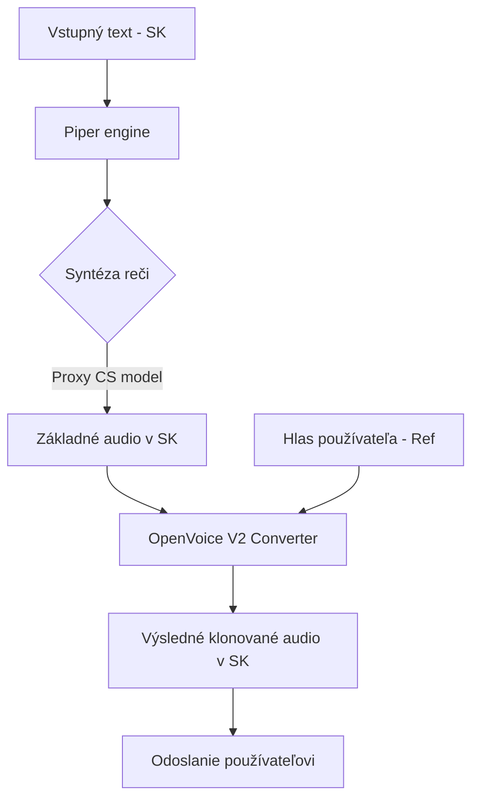

# Porovnanie TTS modelov a stratégia pre BP2

Tento dokument slúži ako technický report pre vedúceho práce. Obsahuje metodiku výberu modelov, namerané výsledky a navrhovanú stratégiu pre druhú fázu bakalárskej práce (BP2).

## 1. Technická metodika a kritériá

Hlavným cieľom systému je **nízka latencia (< 3s)** pri zachovaní **prirodzenosti reči** a podpore **slovenčiny**.

| Kritérium           | Piper (Baseline)    | XTTS v2 (SOTA)    | Hybrid (OpenVoice V2) |
| :------------------ | :------------------ | :---------------- | :-------------------- |
| **Rýchlosť (RTF)**  | 0.05 (Extrémna)     | ~2.80 (Pomalá)    | ~0.25 (Plynulá)       |
| **Podpora SK**      | Proxy (Čeština)     | Natívna           | Proxy + Klonovanie    |
| **Voice Cloning**   | Nie (nutný tréning) | Áno (Zero-shot)   | Áno (Zero-shot)       |
| **Stabilita (MPS)** | Excelentná          | Nízka (nutné CPU) | Dobrá (čiastočná MPS) |

## 2. Architektúra hybridného systému

Pre dosiahnutie klonovania hlasu bez straty rýchlosti sme navrhli **Hybridnú pipeline**:

### Prečo sme zvolili túto cestu?

1. **Piper**: Použitý pre jeho bezkonkurenčnú rýchlosť na Apple Silicon (M1 Pro). Hoci natívny SK model chýba, český model "Jirka" znie v kontexte prekladu prekvapivo prirodzene.
2. **XTTS v2**: Zanechaný ako sekundárna voľba pre "high-fidelity" generovanie. Hlavný problém je vysoká latencia (nad 9s na vete), čo znemožňuje plynulý rozhovor.
3. **OpenVoice V2**: Umožňuje zmeniť "farbu hlasu" (Tone Color) z Piperu na hlas používateľa za menej ako 2s.

## 3. Výsledky testovania (M1 Pro, 16GB RAM)

| Model       | Latencia (veta, 8s audio) | Reálny pocit                                  |
| :---------- | :------------------------ | :-------------------------------------------- |
| **Piper**   | **~0.35s**                | Okamžitá reakcia, mierne robotickejší prejav. |
| **Hybrid**  | **~2.30s**                | Plynulá reakcia, hlas znie ako používateľ.    |
| **XTTS v2** | **~9.69s**                | Jasné čakanie, nepoužiteľné pre živý hovor.   |

## 4. Plán pre BP2

### A. Reálny test (Demonštrácia)

- [ ] **Simulovaný videohovor**: Použitie systému na preklad náhodného YouTube videa alebo zoom hovoru.
- [ ] **Metrika**: Meranie "End-to-End" latencie od zaznenia zdrojovej reči po výsledný TTS výstup.

### B. Integrácia do labu (Telekonferencie)

- Spolupráca s kolegami (Šidla, Tursunov) na prepojení nášho enginu s ich riešením.
- Pridanie **experimentálnych titulkov** generovaných simultánne s audio výstupom.

### C. Článok a publikácia

- Porovnanie Piper vs Hybrid na slovenskom korpuse má potenciál pre konferenciu typu **IIT.SRC** alebo **Redžúr**.
- Zameranie na: "Optimization of low-latency speech-to-speech translation on ARM architecture".

---

_Generated by Antigravity AI for STU FIIT._
