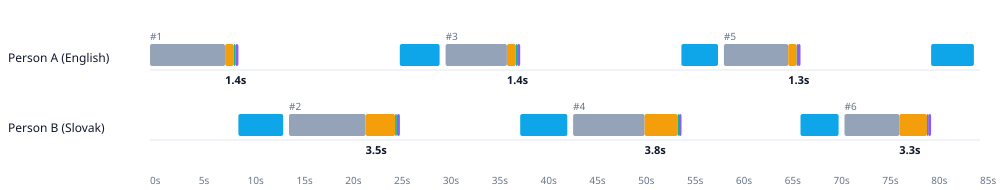
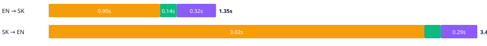
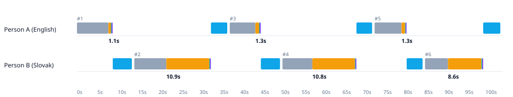
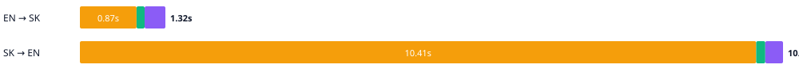
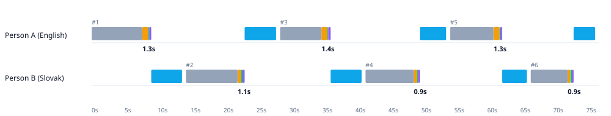

# Two-sided live translation demo, measured (2026-09)

Person A speaks English, Person B answers in Slovak. Every sentence goes through the project's real backends on a CPU-only laptop (Ryzen 5 8645HS laptop · 6 cores · 14 GB · CPU only, no GPU): speech recognition, Opus-MT translation (CTranslate2 int8), Piper voice. `scripts/demo_conversation.py` records the time of every stage; this page is its output for six turns, run with synthetic speech (a clean, repeatable dialogue) and with real recordings, for three Slovak recognizers.

## What it is, in one paragraph

A local speech-to-speech translation pipeline for conferences: no cloud, no GPU, about 0.7 GB of Python packages. Voice-activity detection cuts speech into sentences, a recognizer transcribes them, a translation model converts the text, and a synthetic voice reads the result to the other person. The number that matters for a live conversation is the **delay between the end of a sentence and the start of the translated voice** ("Total" below).

## Result

Median seconds from end of speech to the translated audio being complete (models are loaded once, 30.9 s, and warmed up):

| Slovak recognizer | Input | EN → SK | SK → EN | Slowest SK → EN turn | SK WER |
| --- | --- | --- | --- | --- | --- |
| turbo (old default) | synthetic | 1.05 | 8.88 | 8.9 | 0.07 |
| small-sk (new default) | synthetic | 1.07 | 3.20 | 3.2 | 0.09 |
| parakeet | synthetic | 0.94 | 0.41 | 0.4 | 0.12 |
| turbo (old default) | recordings | 1.26 | 10.79 | 10.9 | n/a |
| small-sk (new default) | recordings | 1.36 | 3.51 | 3.8 | n/a |
| parakeet | recordings | 1.34 | 0.91 | 1.1 | n/a |

- **English → Slovak is about 1 s** regardless of the Slovak recognizer (it uses the English recognizer, Whisper `base`).
- **Slovak → English is decided by the Slovak recognizer.** The previous default `large-v3-turbo` needs about 9-11 s per sentence on this CPU; the Slovak-tuned Whisper `small` (new default) needs about 3 s with the best accuracy; Parakeet v3 is under 1 s but less accurate. Accuracy details: [`model_evaluation_2026-09.md`](model_evaluation_2026-09.md).
- Where the time goes for the default recognizer (median seconds, recognition + translation + voice): EN → SK 0.90 + 0.14 + 0.32, SK → EN 3.02 + 0.13 + 0.29.

## Charts

Each timeline shows both people on one time axis: grey = speaking, orange = speech-to-text, green = translation, purple = text-to-speech, blue = the other person hearing the translated voice. The number under a turn is the delay described above.

**Default recognizer (Slovak-tuned `small`), real recordings**





**Previous default (`large-v3-turbo`), same recordings: every Slovak turn waits about 10 s**





**Parakeet v3: fastest, less accurate**



The synthetic-speech versions of all three are in [`demo/`](demo/) (`timeline_*-synthetic.svg`, `breakdown_*-synthetic.svg`).

## What was said and translated (default recognizer, real recordings)

The recordings are sentences read from a test script, so the two sides do not answer each other; the point is the timing and the recognition/translation quality on real speech.

| # | Direction | Recognized | Translated | Total s |
| --- | --- | --- | --- | --- |
| 1 | EN → SK | Good morning and welcome to this live demonstration of real-time speech translation. | Dobré ráno a vitajte na tejto živej demonštrácii prekladu rečí v reálnom čase. | 1.36 |
| 2 | SK → EN | Dobré ráno a viete, čo je to šivé okažky a pre kultúru reči v riadnom čase. | Good morning, and you know what a gray pair of hooks and a culture of speech is at the right time. | 3.51 |
| 3 | EN → SK | I'm speaking English, and you will hear my own voice speaking Slovak within seconds. | Hovorím po anglicky a môj hlas budete počuť hovoriť po slovensky behom niekoľkých sekúnd. | 1.37 |
| 4 | SK → EN | Hovorím po anglicky a moj hlas budete počuť hovoriť po slovensky do niekoľkých sekúnd. | I speak English and you will hear my voice speak Slovak in a few seconds. | 3.77 |
| 5 | EN → SK | The system listens through the microphone and detects when speech bends and ends. | Systém počúva mikrofónom a detekuje, keď sa reč ohýba a končí. | 1.26 |
| 6 | SK → EN | systém počúva mikrofónom a dedokuje, keď reč sa čína a končí. | the system listens to the microphone and inherits when the language is Chinese and ends. | 3.26 |

## Status

- Working end to end and measured: recognition, translation and voice in both directions, in about 1 s (EN → SK) and about 3 s (SK → EN) on a laptop CPU.
- Slovak recognition quality on real speech is the weak point (WER 0.26 on the project recording, versus 0.13 on public read speech); a new 75-sentence recording set is prepared (`scripts/build_recording_set.py`, `scripts/record_reading.py`) to measure it properly.
- Translated speech is not streamed in these measurements, so "Total" is an upper bound on time-to-first-sound.

## Next

1. Record the 75-sentence set (ideally 2-3 speakers) and repeat the evaluation.
2. Stream the voice output (start playing before the whole sentence is synthesized) and recognize while the person is still speaking.
3. Re-test Parakeet v3 in full precision and with DirectML on the integrated GPU; it is 3-5x faster than the tuned Whisper.
4. Compare translation models (for example NLLB-200) once recognition is no longer the bottleneck.
5. Larger Slovak-tuned Whisper models (`medium`, `large-v3-turbo`) if a GPU is available.

## Reproduce

```bash
python scripts/demo_conversation.py --inputs both --en-dir <english clips> --sk-dir <slovak clips>   --sk-stt "turbo (old default)=large-v3-turbo,small-sk (new default)=ct2_models/whisper-small-sk,parakeet" --docs-dir documentation/demo
```

`demo/conversation_demo_noaudio.html` is the full interactive report without the audio players (open it in a browser); `demo/conversation_demo.json` holds the raw numbers.
